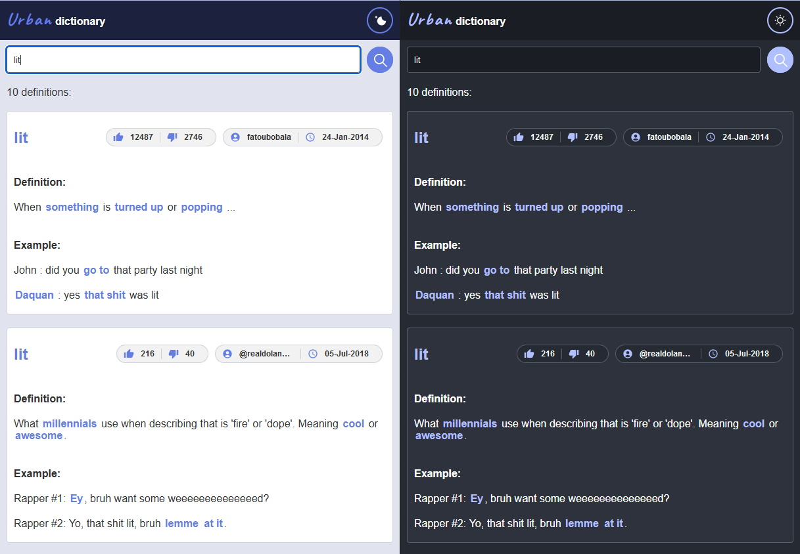

# Urban dictionary

Simple React + TS + Vite app

### Built with

- React js
- Typescript
- Styled components
- Vite
- react-highlight-words

### Features

- multitheme using css variables (changing theme is faster than using theme object)
- fetch data from https://api.urbandictionary.com

### Live site 

- [https://urbn-dictionary.netlify.app/](https://urbn-dictionary.netlify.app/)

### Screenshot

